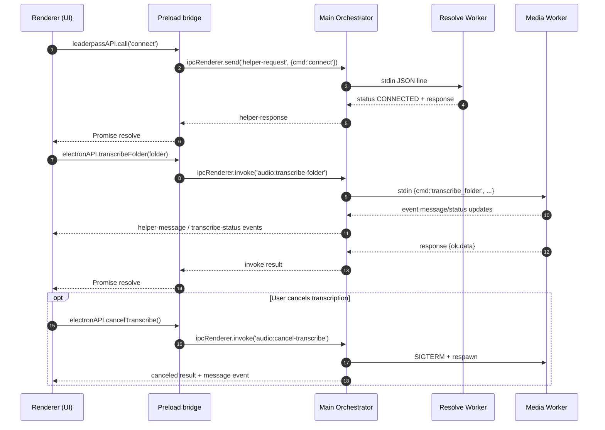

# ADR-001: Target Architecture and Boundaries

- Status: Accepted
- Date: 2026-02-18
- Decision owners: EditPanel maintainers

## Context

The current app already runs as Electron + Python helper processes, but command ownership and layering boundaries are implicit. To safely refactor without UX/perf regressions, we need a locked architecture model with explicit ownership and hard boundaries.

## Decision

Adopt and lock a **4-layer model**:

1. **Electron UI (thin)**
   - Renderer + preload.
   - Responsible only for user interaction and typed IPC calls.
   - No direct knowledge of worker internals.
2. **Orchestrator (Node main process)**
   - Owns IPC endpoints, worker spawning, queueing, lifecycle, cancellation routing.
   - Does not implement Resolve/media domain logic itself.
3. **Resolve Worker (Python helper process)**
   - Owns Resolve session attach, timeline/project commands, render commands.
4. **Media Worker (Python helper process role)**
   - Owns transcription/media processing and CUDA capability checks.
5. **Platform Worker (future extracted role)**
   - Owns OS/filesystem/dialog/integration utilities that do not belong to Resolve/media domain logic.

> Note: today the same Python module (`helper.resolve_helper`) is started twice and used as both Resolve Worker and Media Worker role.

## “Never do” constraints (hard boundaries)

- Renderer must never import Node APIs directly (`contextIsolation` + preload-only bridge).
- Electron UI must never spawn/kill workers directly; only main orchestrator may.
- Orchestrator must never call Resolve APIs directly.
- **Media Worker must never call Resolve APIs** (project/timeline/render/marker/Fusion APIs).
- Resolve Worker must never mutate UI state directly; it can only emit structured events/responses.
- Platform worker responsibilities must not leak Resolve/media business rules.
- Cancellation must always route through orchestrator; renderer must never send OS signals.

## Standard job sequence (one-page diagram)

## Consequences

- Future refactors must preserve this layering and boundaries.
- Worker specialization can be done incrementally by splitting the Python module, while preserving command contracts.
- Performance regression checks become explicit (startup + first-command baselines).

